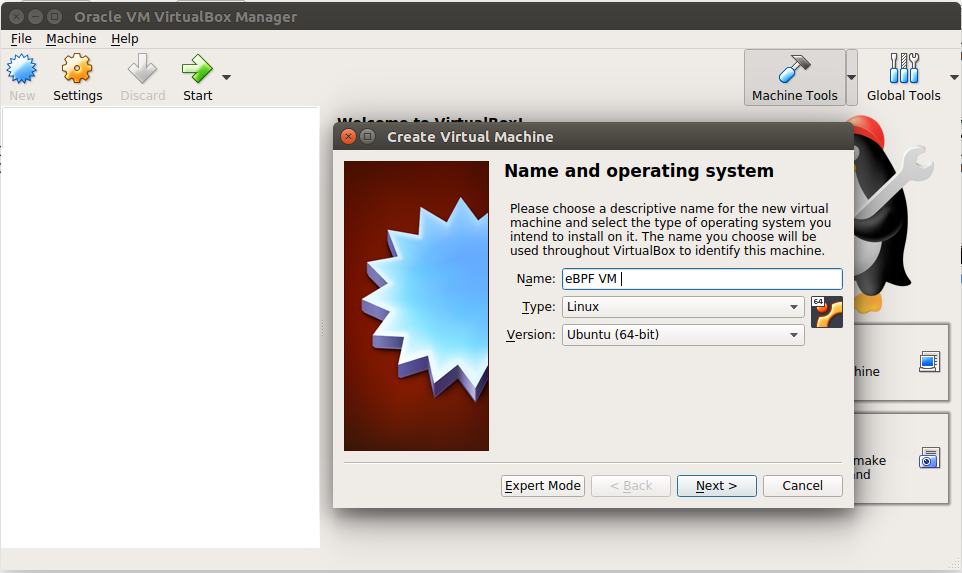
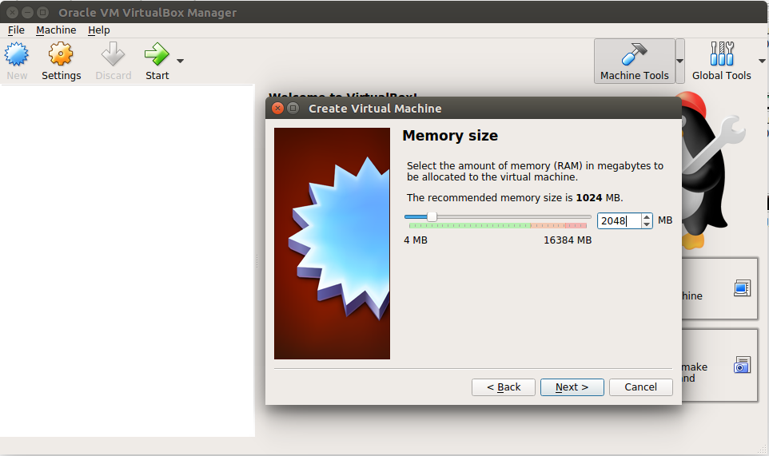
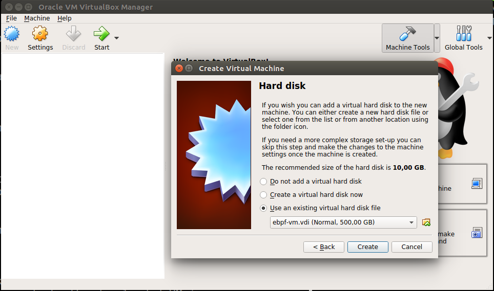
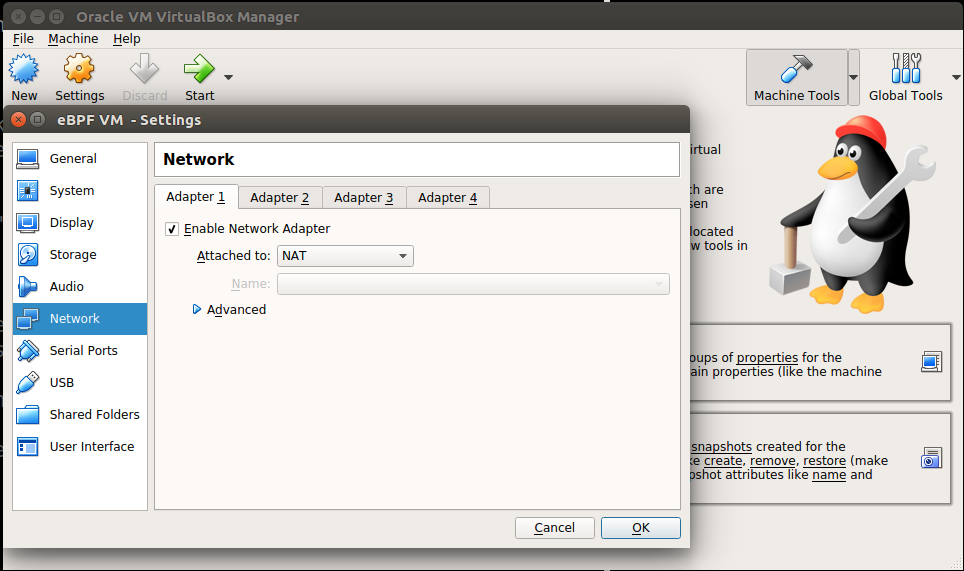
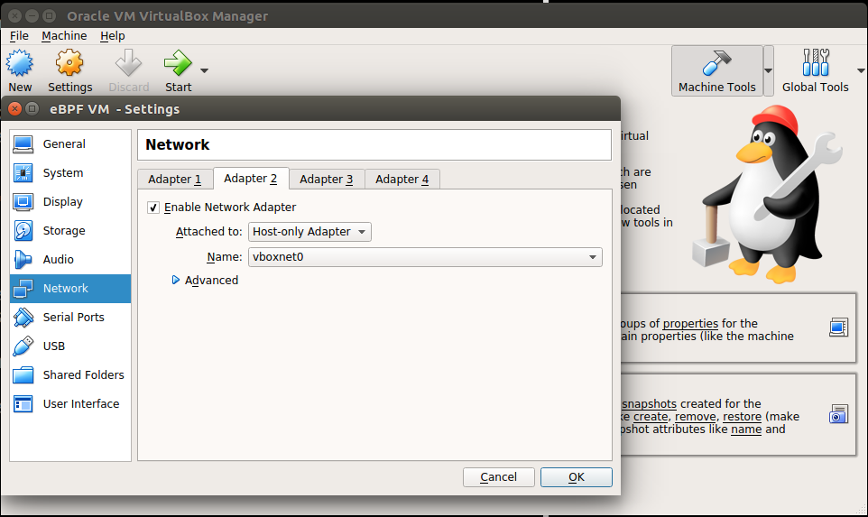

# Fast Packet Processing with eBPF and XDP: Concepts, Code, Challenges and Applications

## About

This repository presents complimentary material to the paper "Fast Packet Processing with eBPF and XDP: Concepts, Code, Challenges and Applications" submitted to ACM Computing Surveys (CSUR).

The contents are divided as as follows:
- `ansible/`: ansible script used to install required dependencies during VM creation
- `examples/`: examples of eBPF programs
- `headers/`: header files needed to compile the examples
- `images/`: images used in this README

## Virtual Machine

We created a virtual machine to be used in this tutorial. It contains all the code and tools required to complete the tutorial step-by-step.

- [Download VirtualBox VM](http://www.winet.dcc.ufmg.br/lib/exe/fetch.php?media=cursos:minicurso_ebpf:ebpf-vm.rar) (user: *ebpf*, password: *ebpf*)

The virtual machine contains the following items:
- kernel v5.0.0
- iproute2-ss190319
- llvm 6.0.0
- bpftool

The directory `/home/ebpf` includes a copy of this repository and also local copies of the following projects:
- [Linux kernel net-next](https://git.kernel.org/pub/scm/linux/kernel/git/davem/net-next.git)
- [iproute2](https://git.kernel.org/pub/scm/network/iproute2/iproute2-next.git)
- [prototype-kernel](https://github.com/netoptimizer/prototype-kernel.git)

## Import the virtual machine

The following steps have been tested with VirtualBox 5.2.18 on Ubuntu.

After downloading the VM image, unzip the file `.rar`. You should then see a file named `ebpf-vm.vdi`.

Open the VirtualBox app and then create a new VM by pressing the `New` button and picking a name for it:

<p align="center">
    
</p>

Next, VirtualBox will allow modifications to the machine specification, such as the amount of RAM (this value can be modified later).

<p align="center">
    
</p>

In the next step, VirtualBox will ask for the desired hard disk option. Here you must use an existing disk, which corresponds to the downloaded VM image:

<p align="center">
    
</p>

Finally, it is necessary to configure the machine with two network interfaces: one in NAT mode (`eth0` - Internet access) and another in HostOnly mode (`eth1` - SSH access).
After the VM creation, right-click on the VM name and then select the `Setting` option.
In the `Network` tab, make sure these two interfaces are created:

<p align="center">
    
    </br>
    </br>
    
</p>

Finished! The machine is now ready for the tutorial.

## Compiling kernel examples

The kernel source code has several sample programs, available in the following directories:
- `samples/bpf`
- `tools/testing/selftests/bpf`

Here we present two examples from `samples/bpf` folder. To compile them, run the following commands:

    cd ~/net-next/
    make headers_install
    make samples/bpf/

## Compiling local examples

The examples provided in this repository in the `examples/` folder are accompanied by a Makefile. To compile them, run:

    cd examples/
    make

**P.S.**: The dependencies required for compilation are already installed on the virtual machine, so we recommend compiling the examples in that environment.

## Examples

Below are the step-by-step instructions on how to compile and run each of the examples presented in the ACM CSUR paper, as well as some extra ones. In-depth explanations of each example are present in the paper.

### Example 0: **Drop World!**

File location: `./examples/dropworld.c`

This example is one of the simplest programs possible. It just discards all received packets.

To compile it, run:

    cd ./examples/
    make

Next, the compiled program can be loaded using the `ip` tool:

    sudo ip -force link set dev eth0 xdp obj dropworld.o sec .text

The `.text` argument refers to the ELF section in which the program is located. Check out the paper for more details.

It is possible to check the status of the program by using the following command:

    ip link show eth0

Expected output:

    ebpf@ebpf-vm:~/bpf-tutorial/examples$ ip link show eth0
    2: eth0: <BROADCAST,MULTICAST,UP,LOWER_UP> mtu 1500 xdpgeneric qdisc fq_codel state UP mode DEFAULT group default qlen 1000
    link/ether 08:00:27:58:07:42 brd ff:ff:ff:ff:ff:ff
    prog/xdp id 19

To remove the program, just run:

    sudo ip link set dev eth0 xdp off

After the removal, the interface status will be as follows:

    ebpf@ebpf-vm:~/bpf-tutorial/examples$ ip link show eth0
    2: eth0: <BROADCAST,MULTICAST,UP,LOWER_UP> mtu 1500 qdisc fq_codel state UP mode DEFAULT group default qlen 1000
        link/ether 08:00:27:58:07:42 brd ff:ff:ff:ff:ff:ff

Since in this case the `eth0` interface is used for Internet access, discarding packets received by this interface will effectively cut off web access.

On another terminal, start a process to ping some domain on the internet:

    ping google.com

Then load the `dropworld.o` program into the `eth0` interface and notice that the ping responses will be interrupted. This interruption will happen because all response messages sent to the `eth0` interface will be discarded by the loaded program.

**Extra**: Modify the `dropworld.c` file by changing the return value from `XDP_DROP` to `XDP_PASS`. Then compile and repeat the loading process. Observe that, in this case, the ping responses will still be received. Thus, this new program is effectively an empty operation, which merely receives and passes packets up to the kernel stack.

### Example 1: **TCP filter**

File location: `./examples/tcpfilter.c`

This example parses packets received on an interface and only accepts the ones with TCP segments. Filtering is done by parsing the IP header protocol field. Only packets with a protocol equal to 6, which corresponds to TCP, are accepted.

Similar to the previous example, compile the program by running:

    cd ./examples/
    make

Before loading the program, try pinging a domain name and test the access to a web page:

    ping google.com
    curl http://www.google.com

The ping must be successful and the output of the second command should be a print of the requested page's HTML code. Since `ping` uses ICMP packets and HTTP operates over TCP, once we load the program, we should continue to receive responses to curl requests and ping responses should be interrupted.

Load the program using the `ip` tool:

    sudo ip -force link set dev eth0 xdp obj tcpfilter.o sec .text

Now, try to access the same page again and then try to ping the same domain:

    curl http://www.google.com
    ping google.com

Because of program *tcpfilter.o*, packets are discarded as soon as they reach the interface `eth0`, preventing access to any service that does not operate over TCP.

**Extra**: Modify the program in `tcpfilter.c` so that it only accepts ICMP packets (used by `ping` utility). Also check the program in `portfilter.c`, which drops packets based on the application layer protocol used.

### Example 2: **User and kernel space interaction**

File locations: `xdp1_kern.c` and `xdp1_user.c` in `samples/bpf/` in kernel source code (`~/net-next/samples/bpf/` in the VM).

This example shows how to use maps in eBPF programs and how to interact with user space. The program in `xdp1_kern.c` extracts the layer 4 protocol number (TCP = 6, UDP = 17, ICMP = 1, etc) from each received packet, updates counters for each protocol and then discards the packets.
The counter values are stored in a map named `rxcnt` and later consulted by the program `xdp1_user.c`, which executes in user space. Through the use of a map, both programs (one in the kernel and another in user space) can exchange information.

To compile the programs, follow the instructions given earlier on how to compile sample programs from the Linux kernel.

Unlike the previous examples, here the eBPF program is loaded into the kernel by the program `xdp_user.c`, in user space, without requiring the use of `ip` tool.

After the program compilation, the `samples/bpf/` directory will contain the executable file `xdp1` (generated from `xdp_user.c`).

    ebpf@ebpf-vm:~/net-next/samples/bpf$ ./xdp1
    usage: xdp1 [OPTS] IFACE

    OPTS:
        -S    use skb-mode
        -N    enforce native mode

To load the program in the `eth0` interface, just pass it as a parameter to `xdp1`:

    ./xdp1 eth0

The program will go into an infinite loop, printing the number of packets received per protocol number so far.

    ebpf@ebpf-vm:~/net-next/samples/bpf$ sudo ./xdp1 eth0
    proto 17:          1 pkt/s
    proto 17:          1 pkt/s
    proto 17:          1 pkt/s
    proto 0:          1 pkt/s
    proto 17:          1 pkt/s

In another terminal, make a request using the `ping`, `curl`, `wget` and similars to get packets to pass through the interface.

It is possible to analyze map content using the Bpftool tool, already compiled and installed on the provided VM. To do this, it is first necessary to check the eBPF programs loaded on the system:

    sudo bpftool prog show

Expected output:

    ebpf@ebpf-vm:~$ sudo bpftool prog show
    2: cgroup_skb  tag 7be49e3934a125ba  gpl
            loaded_at 2019-04-23T12:24:29-0400  uid 0
            xlated 296B  jited 229B  memlock 4096B  map_ids 2,3
    3: cgroup_skb  tag 2a142ef67aaad174  gpl
            loaded_at 2019-04-23T12:24:29-0400  uid 0
            xlated 296B  jited 229B  memlock 4096B  map_ids 2,3
    4: cgroup_skb  tag 7be49e3934a125ba  gpl
            loaded_at 2019-04-23T12:24:29-0400  uid 0
            xlated 296B  jited 229B  memlock 4096B  map_ids 4,5
    5: cgroup_skb  tag 2a142ef67aaad174  gpl
            loaded_at 2019-04-23T12:24:29-0400  uid 0
            xlated 296B  jited 229B  memlock 4096B  map_ids 4,5
    6: cgroup_skb  tag 7be49e3934a125ba  gpl
            loaded_at 2019-04-23T12:24:35-0400  uid 0
            xlated 296B  jited 229B  memlock 4096B  map_ids 6,7
    7: cgroup_skb  tag 2a142ef67aaad174  gpl
            loaded_at 2019-04-23T12:24:35-0400  uid 0
            xlated 296B  jited 229B  memlock 4096B  map_ids 6,7
    28: xdp  name xdp_prog1  tag 539ec6ce11b52f98  gpl
            loaded_at 2019-04-23T14:34:06-0400  uid 0
            xlated 488B  jited 336B  memlock 4096B  map_ids 14

The last program listed corresponds to the XDP program loaded by `xdp1`. The output also indicates that it has a map with id 14. We can use this value to query the map content:

    sudo bpftool map dump id 14

Expected output:

    ebpf@ebpf-vm:~$ sudo bpftool map dump id 14
    key:
    00 00 00 00
    value (CPU 00): 4b 00 00 00 00 00 00 00
    key:
    01 00 00 00
    value (CPU 00): 00 00 00 00 00 00 00 00
    key:
    02 00 00 00
    value (CPU 00): 00 00 00 00 00 00 00 00
    ...
    (rest of output omitted)

The map used is of type `BPF_MAP_TYPE_PERCPU_ARRAY`. As the name implies, it has one array per CPU used. In the map declaration, the number of elements has been set to `256`, so the output of command `bpftool` shows the `256` entries corresponding to CPU 0, the only one on the VM.

**Extra**: Change the program to let packages pass, rather than being dropped. Also, change the map type to `BPF_MAP_TYPE_HASH` and check its content using `bpftool`.

### Example 3: **Cooperation between XDP and TC**

File location: `./examples/layercoop.c`

This example uses two eBPF programs in different layers (XDP and TC) to collect joint statistics about communication between any pair of IPs that cross the corresponding interface.

As before, to compile the example just run:

    cd ./examples/
    make

Now, load and attach the program from section `rx` to the XDP layer on a chosen interface, say `eth0`:

    sudo ip link set dev eth0 xdp obj layercoop.o sec rx

The extra flag `-force` after `ip` might be necessary if another XDP program was already attached to that interface.

Next, we need to load the program responsible for handling the stats collection on TX (ELF section `tx`). But before that, we need to create the `clsact` qdisc on TC:

    sudo tc qdisc add dev eth0 clsact

Now we can load the program on the TC `egress` hook, to run it on TX:

    sudo tc filter add dev eth0 egress bpf da obj layercoop.o sec tx

From now on, all pair of communicating IPs will have an entry on the map shared by these programs, which can be inspected using `bpftool` as explained in the previous example.

Finally, to unload both programs:

    sudo ip link set dev eth0 xdp off
    sudo tc filter del dev eth0 egress

## Extra examples

### Extra example 1: **Packet filtering by TCP port**

File location: `./examples/portfilter.c`

This example parses packets received on an interface and discards the ones with the HTTP protocol. Discarding is done by parsing the TCP header source and destination port fields. Packets in which one of these values is 80 are discarded.

Similar to the previous example, compile the program by running:

    cd ./examples/
    make

Before loading the program, test the access to a web page:

    curl http://www.google.com

The output of this command should be a print of the requested page's HTML code.

Load the program using the `ip` tool:

    sudo ip -force link set dev eth0 xdp obj portfilter.o sec filter

Now, try to access the same page again:

    curl http://www.google.com

Because of program *portfilter.o*, packets are discarded as soon as they reach the interface `eth0`, preventing access to the web.

**Extra**: Modify the program in `portfilter.c` so that it discards all ICMP packets (used by `ping` utility).

### Extra example 2: **Interaction between XDP and TC through metadata field**

File location: `linux/samples/bpf/`: files `xdp2skb_meta_kern.c` and `xdp2skb_meta.sh`

This example aims to demonstrate how the XDP and TC layers can interact through the use of metadata associated with a packet. File `xdp2skb_meta_kern.c` contains two separate programs, one to be loaded into XDP and one to TC, both on reception. Packets received by XDP receive custom metadata, which is read at the TC layer. Script `xdp2skb_meta.sh` is used to load the programs on their respective hooks and configure the system.

To help analyze these programs as well as demonstrate an alternative way to debug eBPF programs, let's modify the `xdp2skb_meta_kern.c` file to print log messages after packet processing on each layer.

To do so, we will use the helper function `bpf_trace_printk`. For ease of use, we can add the following macro to the file:

```c
// Nicer way to call bpf_trace_printk()
#define bpf_custom_printk(fmt, ...)                     \
        ({                                              \
            char ____fmt[] = fmt;                       \
            bpf_trace_printk(____fmt, sizeof(____fmt),  \
                    ##__VA_ARGS__);                     \
        })
```
Through this macro, we can use function `bpf_trace_printk` indirectly, but with a syntax similar to function `printf`.

Having added the macro, we can now use it to print metadata values on TC and XDP layers.

Add to end of function *_xdp_mark()*:

```c
SEC("xdp_mark")
int _xdp_mark(struct xdp_md *ctx)
{
    struct meta_info *meta;
    void *data, *data_end;
    int ret;

    <...> // code omitted

    meta->mark = 42;

    bpf_custom_printk("[XDP] metadata = %d\n",meta->mark); // <-- Add this line

    return XDP_PASS;
}
```

Add to end of function *_tc_mark*:

```c
SEC("tc_mark")
int _tc_mark(struct __sk_buff *ctx)
{
    void *data      = (void *)(unsigned long)ctx->data;
    void *data_end  = (void *)(unsigned long)ctx->data_end;
    void *data_meta = (void *)(unsigned long)ctx->data_meta;
    struct meta_info *meta = data_meta;

    <...> // code omitted

    ctx->mark = meta->mark; /* Transfer XDP-mark to SKB-mark */

    bpf_custom_printk("[TC] metadata = %d\n",meta->mark); // <-- Add this line

    return TC_ACT_OK;
}
```

The `bpf_trace_printk` function requires programs that use it to be declared using GPL license. Otherwise, the program will be rejected by the verifier during kernel loading. The error message generated by the verifier is as follows:

    ebpf@ebpf-vm:~/net-next/samples/bpf$ sudo ./xdp2skb_meta.sh --dev eth0                                                                              [16/1675]

    Prog section 'tc_mark' rejected: Invalid argument (22)!
    - Type:         3
    - Instructions: 25 (0 over limit)
    - License:

    Verifier analysis:

    0: (61) r3 = *(u32 *)(r1 +76)
    1: (61) r2 = *(u32 *)(r1 +140)
    2: (bf) r4 = r2
    3: (07) r4 += 4
    4: (3d) if r3 >= r4 goto pc+3
    R1=ctx(id=0,off=0,imm=0) R2=pkt_meta(id=0,off=0,r=0,imm=0) R3=pkt(id=0,off=0,r=0,imm=0) R4=pkt_meta(id=0,off=4,r=0,imm=0) R10=fp0,call_-1
    5: (b7) r2 = 41
    6: (63) *(u32 *)(r1 +8) = r2
    7: (05) goto pc+15
    23: (b7) r0 = 0
    24: (95) exit

    from 4 to 8: R1=ctx(id=0,off=0,imm=0) R2=pkt_meta(id=0,off=0,r=4,imm=0) R3=pkt(id=0,off=0,r=0,imm=0) R4=pkt_meta(id=0,off=4,r=4,imm=0) R10=fp0,call_-1
    8: (61) r3 = *(u32 *)(r2 +0)
    9: (63) *(u32 *)(r1 +8) = r3
    10: (b7) r1 = 680997
    11: (63) *(u32 *)(r10 -16) = r1
    12: (18) r1 = 0x203d206f64616461
    14: (7b) *(u64 *)(r10 -24) = r1
    15: (18) r1 = 0x74656d205d43545b
    17: (7b) *(u64 *)(r10 -32) = r1
    18: (61) r3 = *(u32 *)(r2 +0)
    19: (bf) r1 = r10
    20: (07) r1 += -32
    21: (b7) r2 = 20
    22: (85) call bpf_trace_printk#6
    cannot call GPL-restricted function from non-GPL compatible program

    Error fetching program/map!
    Unable to load program
    ERROR: Exec error(1) occurred cmd: "tc filter add dev eth0 ingress prio 1 handle 1 bpf da obj ./xdp2skb_meta_kern.o sec tc_mark"

To overcome this limitation, it is necessary to declare a special global variable in the `license` ELF section with this information. This can be done by adding the following line at the end of `xdp2skb_meta_kern.c` file.

```c
char _license[] SEC("license") = "GPL";
```

Finally, recompile the example:

    cd ~/net-next
    make samples/bpf/

Next, execute the script `xdp2skb_meta.sh` to load the programs into the kernel:

    ebpf@ebpf-vm:~/net-next/samples/bpf$ sudo ./xdp2skb_meta.sh

    Usage: ./xdp2skb_meta.sh [-vfh] --dev ethX
    -d | --dev     :             Network device (required)
    --flush        :             Cleanup flush TC and XDP progs
    --list         : ($LIST)     List TC and XDP progs
    -v | --verbose : ($VERBOSE)  Verbose
    --dry-run      : ($DRYRUN)   Dry-run only (echo commands)

    ERROR: Please specify network device -- required option --dev

Load the programs in interface `eth0`:

    ./xdp2skb_meta.sh --dev eth0

We can also load the programs directly using tools as `ip` for the XDP program (`sudo ip -force link set dev eth0 xdp obj xdp2skb_meta_kern.o sec xdp_mark`), just as before, and `tc` for the TC hook program. In the latter case, it is necessary to create a special `qdisc` in the Linux traffic controller, called `clsact`. All this process can be done using the following commands:

    sudo tc qdisc add dev eth0 clsact
    sudo tc filter add dev eth0 ingress bpf da obj xdp2skb_meta_kern.o sec tc_mark

For more information about eBPF on the TC hook, check out the command `man tc-bpf`.

Once the programs have been loaded on their respective hooks, we can analyze the log messages generated by each one in the file `/sys/kernel/debug/tracing/trace`:

    sudo cat /sys/kernel/debug/tracing/trace

For continuous reading, use the file `trace_pipe`:

    sudo cat /sys/kernel/debug/tracing/trace_pipe

With the eBPF programs loaded in the kernel and some traffic flowing through the interface, we can observe the generated messages:

    ebpf@ebpf-vm:~/net-next/samples/bpf$ sudo cat /sys/kernel/debug/tracing/trace
    # tracer: nop
    #
    # entries-in-buffer/entries-written: 40/40   #P:1
    #
    #                              _-----=> irqs-off
    #                             / _----=> need-resched
    #                            | / _---=> hardirq/softirq
    #                            || / _--=> preempt-depth
    #                            ||| /     delay
    #           TASK-PID   CPU#  ||||    TIMESTAMP  FUNCTION
    #              | |       |   ||||       |         |
            <idle>-0     [000] ..s. 13699.213984: 0: [XDP] metadata = 42
            <idle>-0     [000] ..s. 13699.214009: 0: [TC] metadata = 42
            <idle>-0     [000] ..s. 13699.421529: 0: [XDP] metadata = 42
            <idle>-0     [000] ..s. 13699.421542: 0: [TC] metadata = 42
            <idle>-0     [000] ..s. 13704.450195: 0: [XDP] metadata = 42
            <idle>-0     [000] ..s. 13704.450205: 0: [TC] metadata = 42
            <idle>-0     [000] ..s. 13704.450216: 0: [XDP] metadata = 42

By looking at the messages, we can see that the metadata added on the XDP hook could be successfully received by the program on the TC hook, effectively sharing information between the two kernel stack layers.
